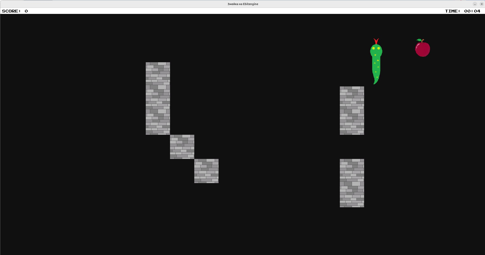
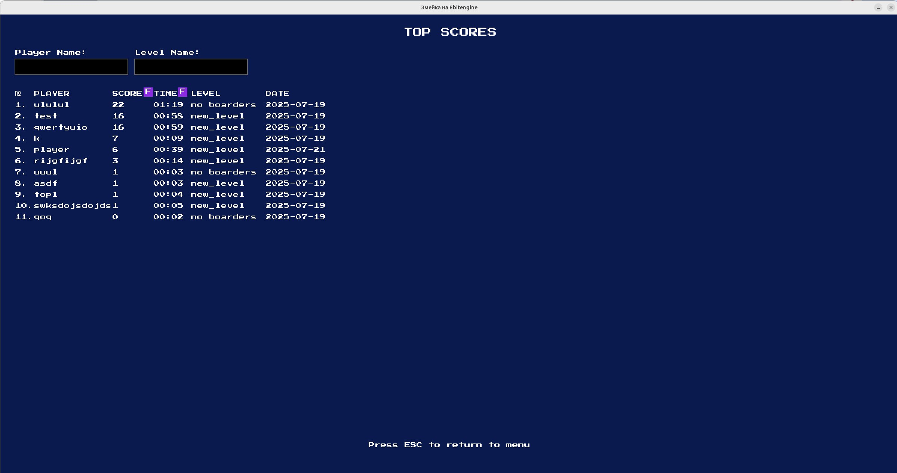
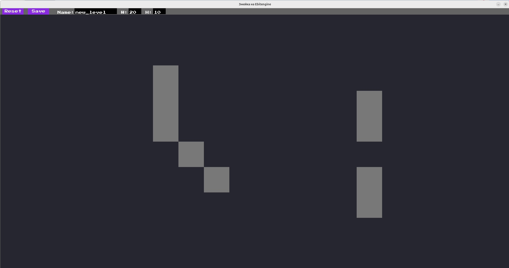
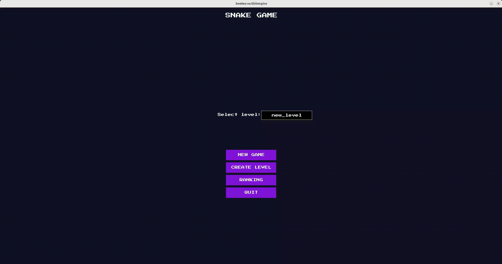

# Змейка на Ebitengine

Проект представляет собой классическую игру "Змейка" с возможностью пользовательского уровня. Результаты игры сохраняются в таблицу рекордов, данные в которой можно фильтровать по названию уровня и имени игрока.

|               Игровой процесс                |                   Результаты                    |               Редактор уровней                |
|:--------------------------------------------:|:-----------------------------------------------:|:---------------------------------------------:|
|  |  |  |

## Создание и тестирование уровня


## Для запуска:

1. Клонируйте репозиторий и перейдите в папку с проектом

```bash
git clone https://github.com/darina-stasevich/snake-game.git
cd snake-game
```

2. В проекте используется `.env` файл для хранения данных для подключения к базе данных. Скопируйте шаблон, чтобы создать свой файл конфигурации.

```bash
cp .env.example .env
```
3. Разрешите подключению к экрану

```bash
xhost +local:
```

4. Запустите игру

```bash
docker-compose up --build
```

5. Для остановки игры - Ctrl+C в терминале, затем
```bash
docker-compose down
```
